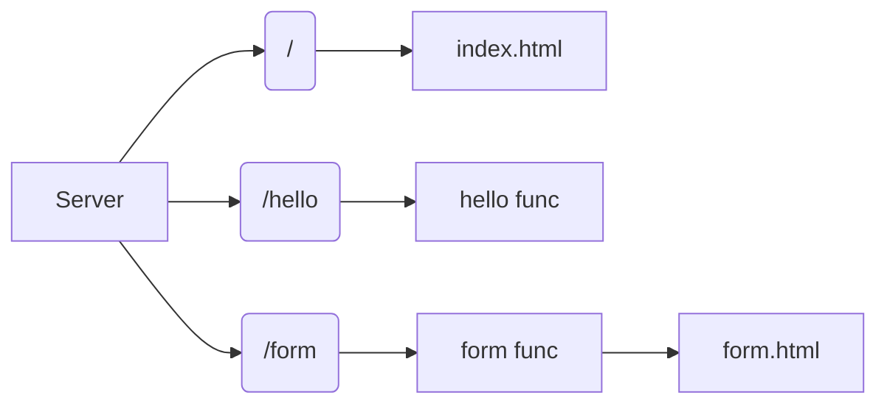

# mini-server

A simple http server using `net/http`

> [🪃Go back](../)

## Run

```sh
go run . main.go
#
# Starting server at port 8080
```

## Usage


```mermaid
flowchart LR
    A[Server]  --> B("/")
    A --> C("/hello")
    A --> D("/form")
    B --> E[index.html]
    C --> F[hello func]
    D --> G[form func]
    G --> H[form.html]
```