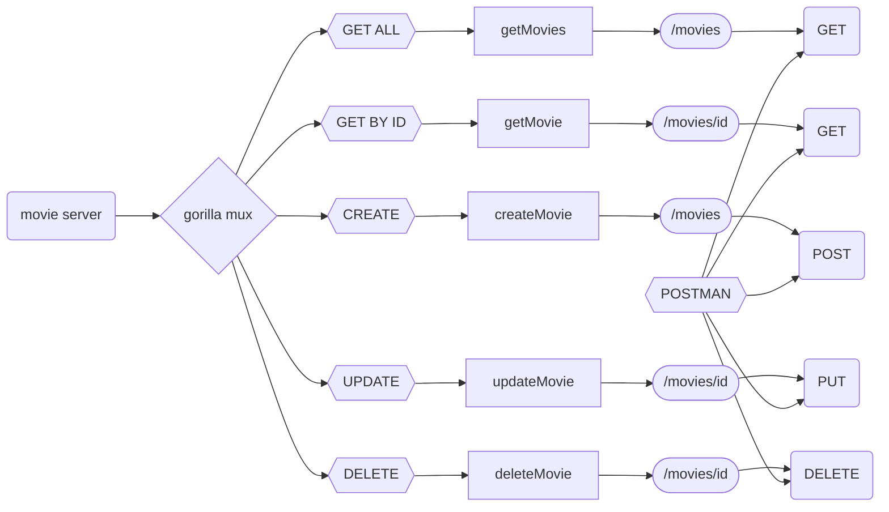

# movies-crud

A simple CRUD API server using `gorilla/mux`

> [🪃Go back](../)

## Run

```sh
go run . main.go
```

## Usage


```mermaid
flowchart LR
    A(movie server) --> B{gorilla mux}
    B --> B1{{GET ALL}}
    B --> B2{{GET BY ID}}
    B --> B3{{CREATE}}
    B --> B4{{UPDATE}}
    B --> B5{{DELETE}}
    B1 --> C1[getMovies]
    B2 --> C2[getMovie]
    B3 --> C3[createMovie]
    B4 --> C4[updateMovie]
    B5 --> C5[deleteMovie]
    C1 --> D1(["/movies"])
    C2 --> D2(["/movies/id"])
    C3 --> D3(["/movies"])
    C4 --> D4(["/movies/id"])
    C5 --> D5(["/movies/id"])
    D1 --> E1(GET)
    D2 --> E2(GET)
    D3 --> E3(POST)
    D4 --> E4(PUT)
    D5 --> E5(DELETE)
    F{{POSTMAN}} --> E1
    F --> E2
    F --> E3
    F --> E4
    F --> E5
```
